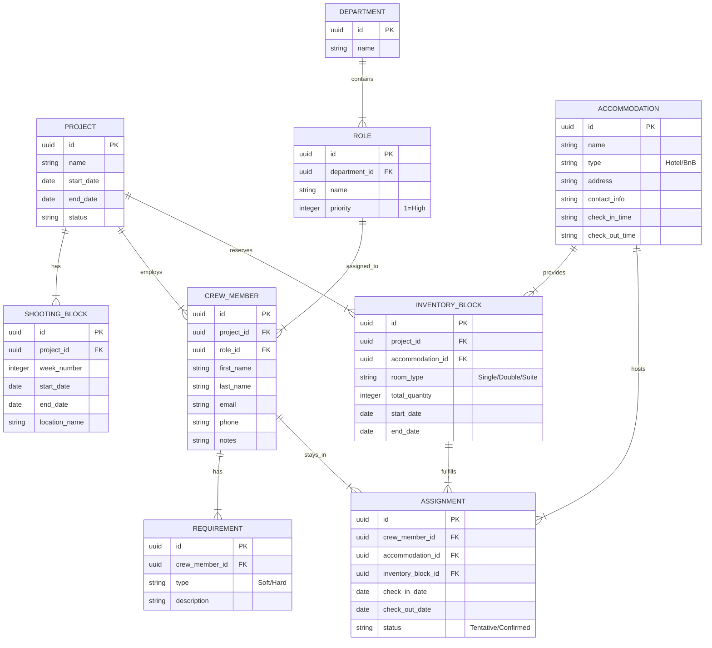

# Data Model ER Diagram

This diagram represents the core data entities and their relationships for the CrewQuarters application.

```mermaid
erDiagram
    PROJECT ||--|{ SHOOTING_BLOCK : "has"
    PROJECT ||--|{ CREW_MEMBER : "employs"
    PROJECT ||--|{ INVENTORY_BLOCK : "reserves"

    DEPARTMENT ||--|{ ROLE : "contains"
    ROLE ||--|{ CREW_MEMBER : "assigned_to"

    CREW_MEMBER ||--|{ REQUIREMENT : "has"
    CREW_MEMBER ||--|{ ASSIGNMENT : "stays_in"

    ACCOMMODATION ||--|{ INVENTORY_BLOCK : "provides"
    ACCOMMODATION ||--|{ ASSIGNMENT : "hosts"
    
    INVENTORY_BLOCK ||--|{ ASSIGNMENT : "fulfills"

    PROJECT {
        uuid id PK
        string name
        date start_date
        date end_date
        string status
    }

    SHOOTING_BLOCK {
        uuid id PK
        uuid project_id FK
        integer week_number
        date start_date
        date end_date
        string location_name
    }

    DEPARTMENT {
        uuid id PK
        string name
    }

    ROLE {
        uuid id PK
        uuid department_id FK
        string name
        integer priority "1=High"
    }

    CREW_MEMBER {
        uuid id PK
        uuid project_id FK
        uuid role_id FK
        string first_name
        string last_name
        string email
        string phone
        string notes
    }

    REQUIREMENT {
        uuid id PK
        uuid crew_member_id FK
        string type "Soft/Hard"
        string description
    }

    ACCOMMODATION {
        uuid id PK
        string name
        string type "Hotel/BnB"
        string address
        string contact_info
        string check_in_time
        string check_out_time
    }

    INVENTORY_BLOCK {
        uuid id PK
        uuid project_id FK
        uuid accommodation_id FK
        string room_type "Single/Double/Suite"
        integer total_quantity
        date start_date
        date end_date
    }

    ASSIGNMENT {
        uuid id PK
        uuid crew_member_id FK
        uuid accommodation_id FK
        uuid inventory_block_id FK
        date check_in_date
        date check_out_date
        string status "Tentative/Confirmed"
    }
```
