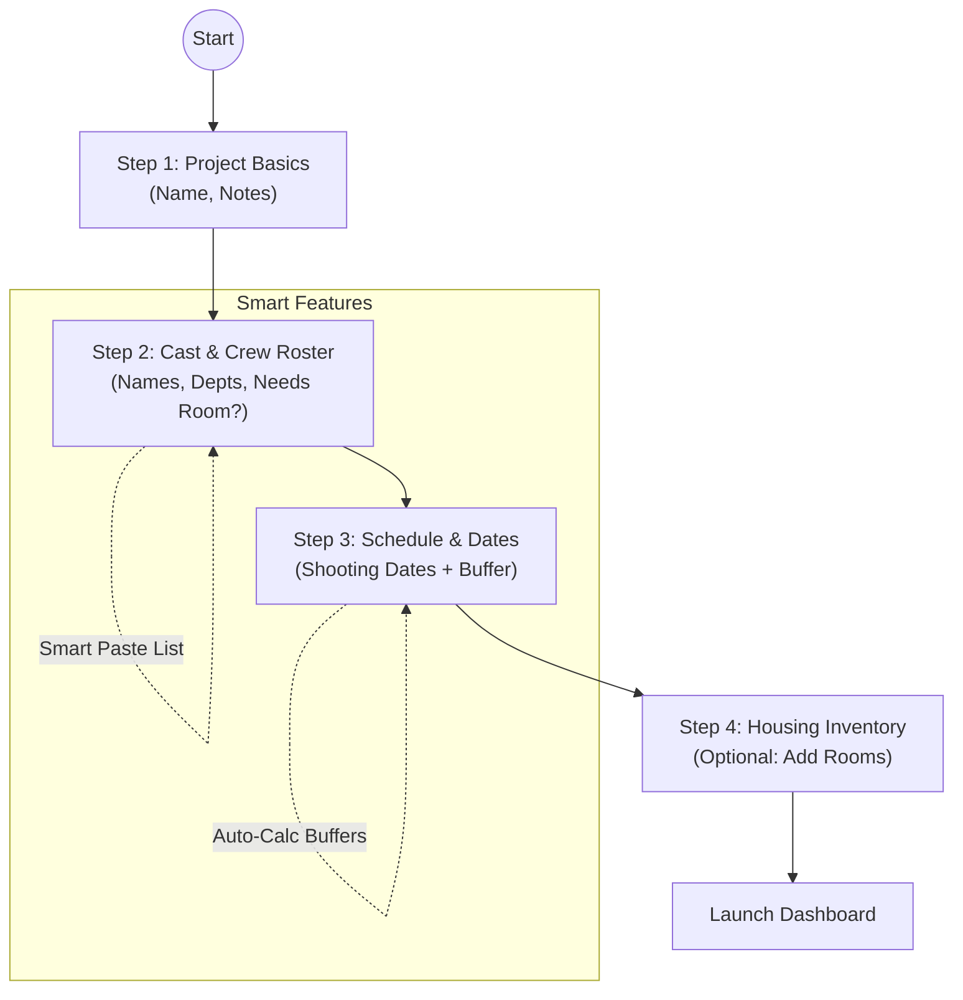

# Product Backlog: CrewQuarters - New Film Project Workflow

## Goal
Create an intuitive, "Wow" workflow for setting up a new film project that accommodates incomplete information and progressively builds the necessary data for housing management.

---

## Proposed Workflow: "New Project Wizard"
This workflow is designed to be forgiving and helpful. It anticipates Annie's needs (like buffer dates) but doesn't block her if she doesn't have all the answers yet.

### Step 1: The "Slate" (Project Basics)
* **User Action**: Enters Project Name.
* **Optional**: Add initial notes or description.
* **Philosophy**: "Get the folder open first."

### Step 2: The "Cast & Crew" (Roster) - *Prioritized*
* **Goal**: Get names in as the first real step. "People first."
* **"Wow" Feature**: "Smart Paste" - Paste a list of names from an email or spreadsheet.
* **Action**: User populates the list.
* **Smart Default**: Mark all as "Needs Room" by default.

### Step 3: The "Schedule" (Shooting Dates)
## Project
*   **Name**: String (e.g., "The Lighthouse")
*   **Shooting Dates**: Array of { Name: String, Start: Date, End: Date }
*   **Notes**: String
* **User Action**: Define *when* and *where* the production is happening.
* **Smart Input**: Add multiple "Shooting Dates" (e.g. "Lunenburg", "Halifax").
* **Fields**: Name/Location + Date Range.
* **System Logic**: Automatically calculates "Accommodation Dates" (Start - 1 day, End + 1 day) for each block.

### Step 4: The "Inventory" (Rough Housing)
* **Question**: "Do you have rooms reserved yet?"
* **If Yes**: Quick add for blocks. "Hotel Lunenburg Arms - 10 Rooms".
* **If No**: Skip. "I'll add this later".

### Step 5: Launch
* **Result**: Takes user to the main Dashboard/Grid view with the framework set up, ready for the detailed "Tetris" of assigning specific people to specific rooms.

## Visual Workflow

---

## Backlog: Epics & Stories

### Epic 1: Project Initialization
**Goal**: Establish the project container with smart defaults.

*   **Story 1.1: Create Project Basics**
    *   *As a* Production Coordinator, *I want to* start a project with just a Name, *so that* I can get straight to adding my team without looking up dates yet.
    *   *Acceptance Criteria*:
        *   Input Project Name (Required).
        *   Input Notes (Optional).
        *   System creates project container.

*   **Story 1.2: Add Dates Later**
    *   *As a* Coordinator, *I want* to define the shooting schedule *after* I've started the project, *so that* I can focus on the roster first.
    *   *Acceptance Criteria*:
        *   Step 3 allows input of Start/End Dates.
        *   System calculates defaults (Start-1, End+1).

### Epic 2: Roster Management (The "Who")
**Goal**: Rapidly populate the crew list without friction.

*   **Story 2.1: Quick Add Crew Member**
    *   *As a* Coordinator, *I want to* add a crew member with just a Name, *so that* I don't get stuck finding their email or department right now.
    *   *Acceptance Criteria*:
        *   Name is the only required field.
        *   Department and Role are optional.
        *   "Notes" field available for special requests (e.g., "Has dog").

*   **Story 2.2: Bulk Import / Smart Paste**
    *   *As a* Coordinator, *I want to* paste a list of names, *so that* I can add 50 crew members in seconds.
    *   *Acceptance Criteria*:
        *   Text area accepts newline-separated names.
        *   System creates individual records for each line.

*   **Story 2.3: Special Requirements Tracking**
    *   *As a* Coordinator, *I want to* tag crew members with "No Room Needed" or "brings dog", *so that* I don't book rooms for people who don't need them.
    *   *Acceptance Criteria*:
        *   Toggle/Checkbox for "Requires Housing" (Default: Yes).
        *   Free text "Notes" field.

### Epic 3: Schedule & Inventory Structure
**Goal**: set up the "board" for housing assignments.

*   **Story 3.1: Weekly Slot Generation**
    *   *As a* system, *I want to* automatically generate "Week" columns based on the project dates, *so that* the grid is organized by production weeks (Sun-Sat).
    *   *Acceptance Criteria*:
        *   Given start/end dates, system divides time into 7-day chunks (Sunday start).

*   **Story 3.2: Accommodation Inventory Placeholders**
    *   *As a* Coordinator, *I want to* list the Hotels/Houses I have booked, *so that* I know my capacity.
    *   *Acceptance Criteria*:
        *   Add "Property" (Name, Address).
        *   Add "Capacity" (Total Rooms).

### Epic 4: Logic & Alerts (Future/Advanced)
*   **Story 4.1**: Alert when "Check-out" date approaches.
*   **Story 4.2**: Highlight unassigned crew members for active dates.
