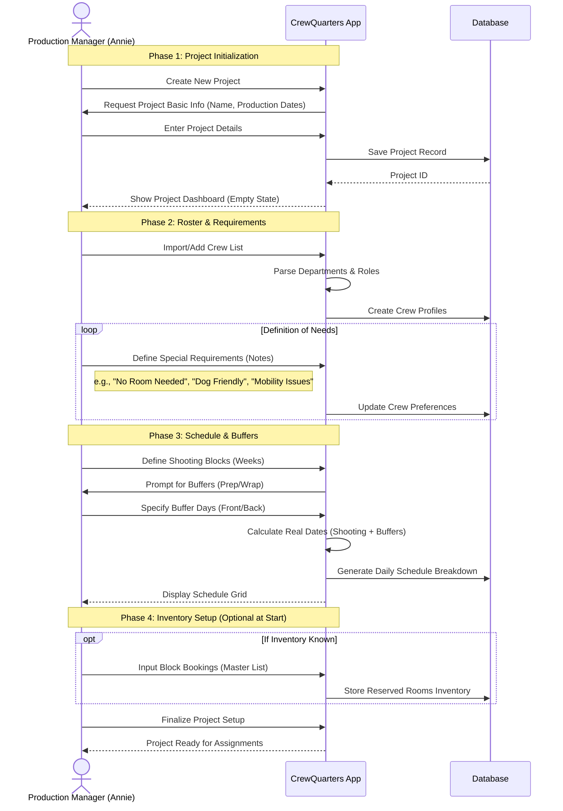

# Project Creation Flow Sequence Diagram

This diagram illustrates the flow for setting up a new film project in CrewQuarters, based on the reference workflow instructions.

```mermaid
sequenceDiagram
    actor PM as Production Manager (Annie)
    participant System as CrewQuarters App
    participant DB as Database

    Note over PM, System: Phase 1: Project Initialization

    PM->>System: Create New Project
    System->>PM: Request Project Basic Info (Name, Production Dates)
    PM->>System: Enter Project Details
    System->>DB: Save Project Record
    DB-->>System: Project ID
    System-->>PM: Show Project Dashboard (Empty State)

    Note over PM, System: Phase 2: Roster & Requirements

    PM->>System: Import/Add Crew List
    System->>System: Parse Departments & Roles
    System->>DB: Create Crew Profiles
    
    loop Definition of Needs
        PM->>System: Define Special Requirements (Notes)
        Note right of PM: e.g., "No Room Needed", "Dog Friendly", "Mobility Issues"
        System->>DB: Update Crew Preferences
    end

    Note over PM, System: Phase 3: Schedule & Buffers

    PM->>System: Define Shooting Blocks (Weeks)
    System->>PM: Prompt for Buffers (Prep/Wrap)
    PM->>System: Specify Buffer Days (Front/Back)
    System->>System: Calculate Real Dates (Shooting + Buffers)
    System->>DB: Generate Daily Schedule Breakdown
    System-->>PM: Display Schedule Grid

    Note over PM, System: Phase 4: Inventory Setup (Optional at Start)

    opt If Inventory Known
        PM->>System: Input Block Bookings (Master List)
        System->>DB: Store Reserved Rooms Inventory
    end

    PM->>System: Finalize Project Setup
    System-->>PM: Project Ready for Assignments
```
